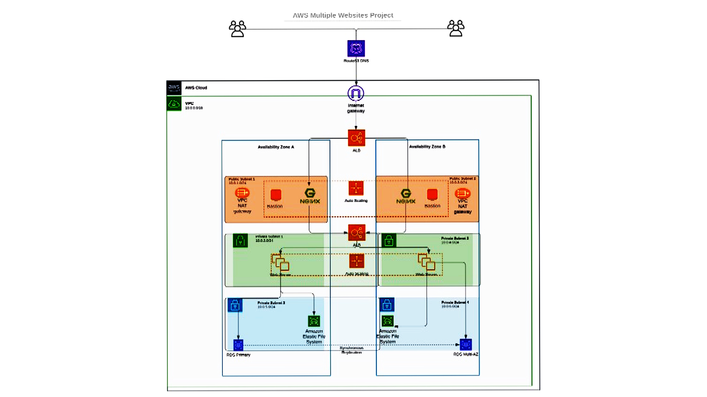
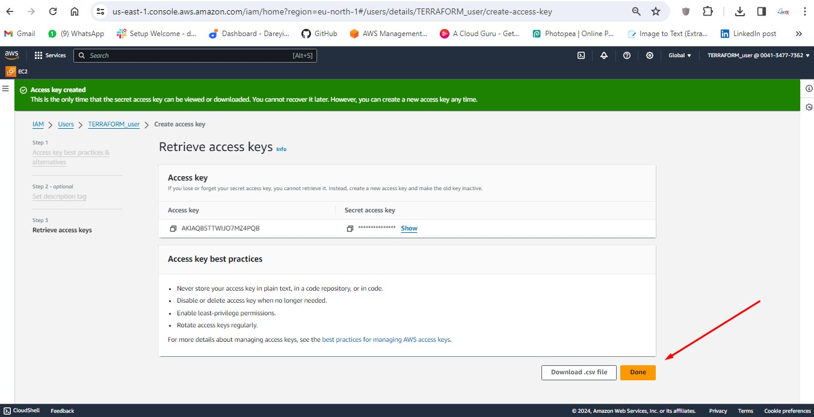
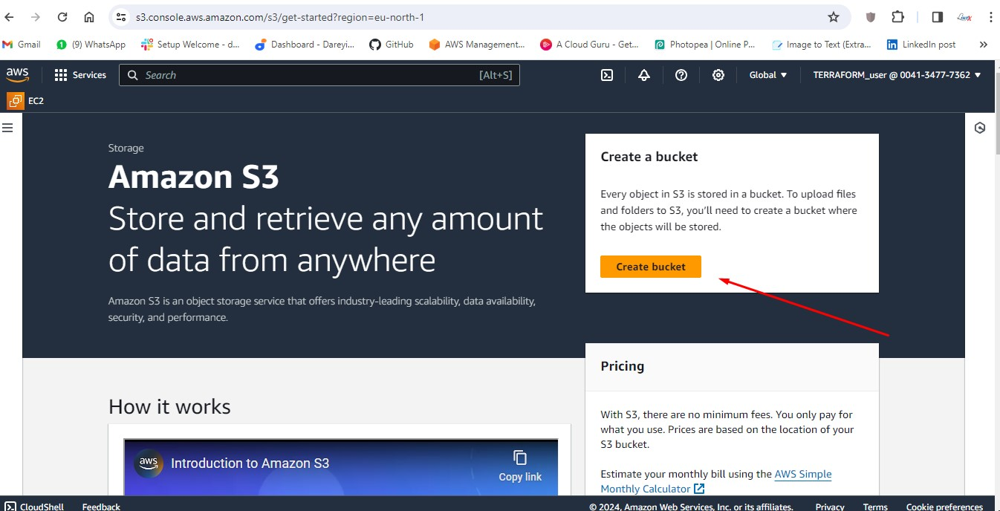
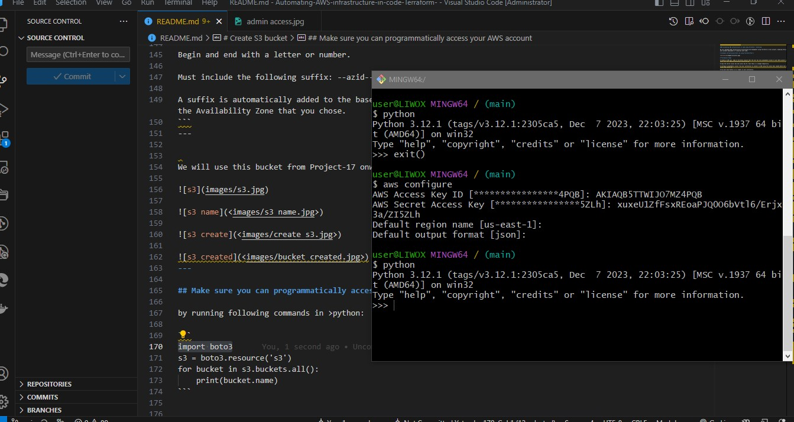
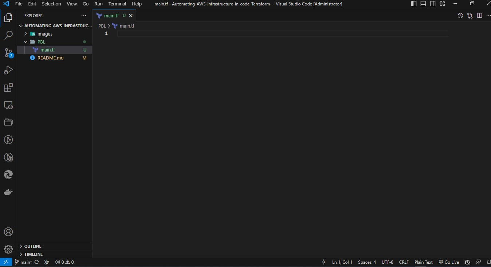

#### Automating AWS infrastructure in code using Terraform - Armstrong

We will Automate AWS infrastructure provisioning and management using Terraform in this project, enabling efficient and scalable deployment of resources with code.

# Automate Infrastructure With laC using Terraform Part 1



# Preliminary Steps

• Create an IAM user, name it terraform (ensure that the user has only programatic access to your AWS account) and grant this user AdministratorAccess permissions. 

• Copy the secret access key and access key ID. Save them in a notepad temporarily.

• Configure programmatic access from your workstation to connect to AWS using the access keys copied above and a Python SDK (boto3). 

• You must have Python 3.6 or higher on your workstation.

• For Windows OS, use gitbash, if you are on a Mac, you can simply open a terminal . 

• Read here (https://boto3.amazonaws.com/v1/documentation/api/latest/guide/quickstart.html) to configure the Python SDK properly.

> Documentation and developers tend to refer to the AWS SDK for Python as “Boto3,” and this documentation often does so as well.

For easier authentication configuration - use 
 ```AWS CLI``` with aws configure command.

• Create an S3 bucket to store Terraform state file. You can name it something like <yourname>-dev-terraform-bucket (Note: S3 bucket names must be unique unique within a region partition, you can read about $3 bucken naming in this article). We will use this bucket from Project-17 onwards.
When you have configured authentication and installed boto3, make sure you can programmatically access your AWS account by running following commands in

>Useful websites
```
https://www.python.org/downloads/
https://boto3.amazonaws.com/v1/documentation/api/latest/index.html
https://docs.python.org/3.12/tutorial/index.html
https://docs.python.org/3.12/index.html
https://docs.python.org/3.12/using/windows.html
https://docs.python.org/3.12/whatsnew/3.12.html
https://github.com/boto/boto3
```
# what is an SDK
> SDK stands for Software Development Kit. It contains a set of preconfigured tools and libraries. The AWS SDK for Python (Boto3) provides a Python API for AWS infrastructure services. Using the SDK for Python, you can build applications on top of Amazon S3, Amazon EC2, Amazon DynamoDB, and more.

# what is Boto3

> Boto3 allows us to write Python code that interacts with AWS services. It acts like an intermidiary between us and the service we want to manage. It contains easy-to-use APIs to many AWS services.


# Creating an IAM user


---

---

---

---

---

https://004134777362.signin.aws.amazon.com/console

TERRAFORM_user

password : ..........

[login details](<images/iam credentials.txt>)
---

---

---
---


---

---

---

---


# Installing AWS CLI


---

---

---

---

```
msiexec.exe /i https://awscli.amazonaws.com/AWSCLIV2.msi
```
---


# Create S3 bucket

Create an S3 bucket to store Terraform state file.

```armstrong-dev-terraform-bucket```

S3 bucket names must be unique unique within a region partition.
 
you can read about S3 bucken naming in this article - 
https://docs.aws.amazon.com/AmazonS3/latest/userguide/bucketnamingrules.html


## General purpose buckets naming rules
The following naming rules apply for general purpose buckets.
```
Bucket names must be between 3 (min) and 63 (max) characters long.

Bucket names can consist only of lowercase letters, numbers, dots (.), and hyphens (-).

Bucket names must begin and end with a letter or number.

Bucket names must not contain two adjacent periods.

Bucket names must not be formatted as an IP address (for example, 192.168.5.4).

Bucket names must not start with the prefix xn--.

Bucket names must not start with the prefix sthree- and the prefix sthree-configurator.

Bucket names must not end with the suffix -s3alias. This suffix is reserved for access point alias names
```
## Directory bucket naming rules
Directory bucket names must:
```
Be unique within the chosen AWS Region and Availability Zone.

Be no more than 3–63 characters long, including the suffix.

Consists only of lowercase letters, numbers and hyphens (-).

Begin and end with a letter or number.

Must include the following suffix: --azid--x-s3.

A suffix is automatically added to the base name that you provide. This suffix includes the Availability Zone ID of the Availability Zone that you chose.
```
---


We will use this bucket from Project-17 onwards.




---

## Make sure you can programmatically access your AWS account 

by running following commands in >python:

```

s3 = boto3.resource('s3')
for bucket in s3.buckets.all():
    print(bucket.name)
```


```
pip install boto3
```

---
```
python.exe -m pip install --upgrade pip
```

---
```
import boto3
```
```
import json
```
---


import boto3
s3 = boto3.resource('s3')

```
aws configure
```

```
cat ~/.aws/credentials
```

print(bucket.name)

The terraform glossary shows brief definitions of some of the technical terms used in the documentation for Terraform, as well as some terms that come up frequently in conversations throughout the Terraform community.

## Terraform specific terminology
> These are Terraform-specific terminology, such as:

[Attribute,
Resource,
Interpolations,
Argument,
Providers,
Provisioners,
Input Variables,
Output Variables,
Module,
Data Source,
Local Values,
Backend.](https://developer.hashicorp.com/terraform/docs/glossary)


## Configuration Syntax

The syntax of Terraform configurations is called HashiCorp Configuration Language (HCL). 
It is meant to strike a balance between human readable and editable as well as being machine-friendly. 
For machine-friendliness, Terraform can also read JSON configurations. 
For general Terraform configurations, however, we recommend using the HCL Terraform syntax.

> The Terraform language syntax is built around two key syntax constructs: *arguments and blocks.*

- Arguments

An argument assigns a value to a particular name:
```image_id = "abc123"```

The identifier before the equals sign is the argument name, and the expression after the equals sign is the argument's value

- Blocks
A block is a container for other content:
```resource "aws_instance" "example" {
  ami = "abc123"

  network_interface {
    # ...
  }
}
```
$$
A block has a type (resource in this example). Each block type defines how many labels must follow the type keyword. The resource block type expects two labels, which are aws_instance and example in the example above. A particular block type may have any number of required labels, or it may require none as with the nested network_interface block type.

After the block type keyword and any labels, the block body is delimited by the { and } characters. Within the block body, further arguments and blocks may be nested, creating a hierarchy of blocks and their associated arguments.

The Terraform language uses a limited number of top-level block types, which are blocks that can appear outside of any other block in a configuration file. Most of Terraform's features (including resources, input variables, output values, data sources, etc.) are implemented as top-level blocks.
$$


## Local values

A local value assigns a name to an expression, so you can use it multiple times within a module without repeating it.

If you're familiar with traditional programming languages, it can be useful to compare Terraform modules to function definitions:

*Input variables* are like function arguments.
*Output values* are like function return values.
*Local values* are like a function's temporary local variables.

*Note:* For brevity, local values are often referred to as just "locals" when the meaning is clear from context.

## Backend
The part of Terraform's core that determines how Terraform stores state and performs operations (like plan, apply, import, etc.).

## Data Type

Data type is a general programing concept, it refers to how data represented in a programming language and defines how a compiler or interpreter can use the data. Common data types are:

$$
Integer,
Float,
String,
Boolean, etc.
$$

## Best practices
1. Ensure that every resource is tagged using multiple key-value pairs. You will see this in action as we go along.

2. Try to write reusable code, avoid hard coding values wherever possible. (For learning purpose, we will start by hard coding, but gradually refactor our work to follow best practices).

# Base Infrastructure Automation (VPC | Subnets | Security Groups)

We will create a directory structure via Visual Studio Code:

1. Create a folder called PBL

2. Create a file in the folder, name it main.tf
---

---
### Provider and VPC resource section

> Set up Terraform CLI as per this instruction.

1. Add AWS as a provider, and a resource to create a VPC in the main.tf file.

2. Provider block informs Terraform that we intend to build infrastructure within AWS.

3. Resource block will create a VPC.

```
provider "aws" {
  region = "eu-central-1"
}

# Create VPC
resource "aws_vpc" "main" {
  cidr_block                     = "172.16.0.0/16"
  enable_dns_support             = "true"
  enable_dns_hostnames           = "true"
  enable_classiclink             = "false"
  enable_classiclink_dns_support = "false"

}
```

---

---


