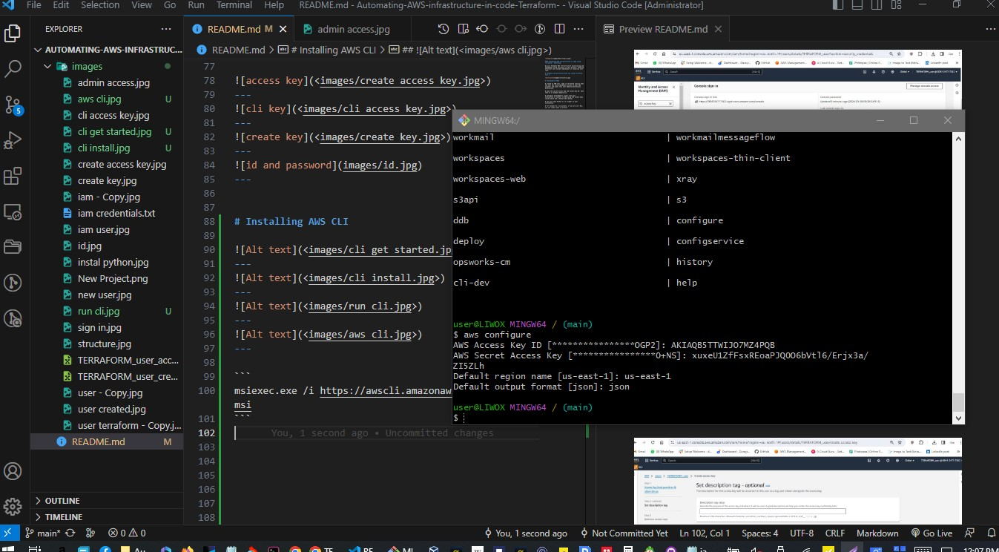

#### Automating AWS infrastructure in code using Terraform - Armstrong

We will Automate AWS infrastructure provisioning and management using Terraform in this project, enabling efficient and scalable deployment of resources with code.

# Automate Infrastructure With laC using Terraform Part 1


# Preliminary Steps

• Create an IAM user, name it terraform (ensure that the user has only programatic access to your AWS account) and grant this user AdministratorAccess permissions. 

• Copy the secret access key and access key ID. Save them in a notepad temporarily.

• Configure programmatic access from your workstation to connect to AWS using the access keys copied above and a Python SDK (boto3). 

• You must have Python 3.6 or higher on your workstation.

• For Windows OS, use gitbash, if you are on a Mac, you can simply open a terminal . 

• Read here (https://boto3.amazonaws.com/v1/documentation/api/latest/guide/quickstart.html) to configure the Python SDK properly.

> Documentation and developers tend to refer to the AWS SDK for Python as “Boto3,” and this documentation often does so as well.

For easier authentication configuration - use 
 ```AWS CLI``` with aws configure command.

• Create an S3 bucket to store Terraform state file. You can name it something like <yourname>-dev-terraform-bucket (Note: S3 bucket names must be unique unique within a region partition, you can read about $3 bucken naming in this article). We will use this bucket from Project-17 onwards.
When you have configured authentication and installed boto3, make sure you can programmatically access your AWS account by running following commands in

>Useful websites
```
https://www.python.org/downloads/
https://boto3.amazonaws.com/v1/documentation/api/latest/index.html
https://docs.python.org/3.12/tutorial/index.html
https://docs.python.org/3.12/index.html
https://docs.python.org/3.12/using/windows.html
https://docs.python.org/3.12/whatsnew/3.12.html
https://github.com/boto/boto3
```
# what is an SDK
> SDK stands for Software Development Kit. It contains a set of preconfigured tools and libraries.

# what is Boto3

> Boto3 allows us to write Python code that interacts with AWS services. It acts like an intermidiary between aus and the service we want to manage. It contains easy-to-use APIs to many AWS services.


# Creating an IAM user


---

---

---

---

---

https://004134777362.signin.aws.amazon.com/console

TERRAFORM_user

password : ..........

[login details](<images/iam credentials.txt>)
---

---

---
---


---

---

---

---


# Installing AWS CLI


---

---

---

---

```
msiexec.exe /i https://awscli.amazonaws.com/AWSCLIV2.msi
```
---


# Create S3 bucket

Create an S3 bucket to store Terraform state file.

```armstrong-dev-terraform-bucket```

S3 bucket names must be unique unique within a region partition.
 
you can read about S3 bucken naming in this article - 
https://docs.aws.amazon.com/AmazonS3/latest/userguide/bucketnamingrules.html


## General purpose buckets naming rules
The following naming rules apply for general purpose buckets.
```
Bucket names must be between 3 (min) and 63 (max) characters long.

Bucket names can consist only of lowercase letters, numbers, dots (.), and hyphens (-).

Bucket names must begin and end with a letter or number.

Bucket names must not contain two adjacent periods.

Bucket names must not be formatted as an IP address (for example, 192.168.5.4).

Bucket names must not start with the prefix xn--.

Bucket names must not start with the prefix sthree- and the prefix sthree-configurator.

Bucket names must not end with the suffix -s3alias. This suffix is reserved for access point alias names
```
## Directory bucket naming rules
Directory bucket names must:
```
Be unique within the chosen AWS Region and Availability Zone.

Be no more than 3–63 characters long, including the suffix.

Consists only of lowercase letters, numbers and hyphens (-).

Begin and end with a letter or number.

Must include the following suffix: --azid--x-s3.

A suffix is automatically added to the base name that you provide. This suffix includes the Availability Zone ID of the Availability Zone that you chose.
```
---


We will use this bucket from Project-17 onwards.


---

## Make sure you can programmatically access your AWS account 

by running following commands in >python:

```
import boto3
s3 = boto3.resource('s3')
for bucket in s3.buckets.all():
    print(bucket.name)
```


